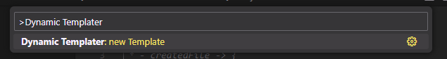

# Dynamic Templater

[ENG - Content in english](#description)

[POR - Conteúdo em português](#descrição)

---

## Description

The Dynamic Templater extension for Visual Studio Code provides a simple and effective way to create and utilize dynamic templates to streamline the process of creating pre-made files. With Dynamic Templater, you can create and use custom templates to quickly generate new files with dynamic content.

## Key features

- **Template Creation**: Easily create template files for various file types such as JavaScript, TypeScript, HTML, CSS, and many others.

  

- **File Generation**: Create new files based on your custom templates, preenchendo automaticamente o conteúdo dinâmico com base em um objeto de opções fornecido.

  

- **Dynamic Content**: Templates can be configured to receive an options object, allowing the inclusion of dynamic content in the template during file generation.

## How To

- **Creating a template based on file** (New File Based on Template):

  

- **Creating a new template** (New Template):

  

- **Modifying a template**:

  

- **Creating a File Based on the Modified Template**:

  

## Available Settings

- `dynamic_templater.author.name`: Define the author's name, this value will be available in the 'options.author.name' parameter of the Template's render function.
- `dynamic_templater.author.email`: Set the author's email, this value will be available in the 'options.author.email' parameter of the Template's render function.
- `dynamic_templater.customOptions`: Defines an object of additional custom options that will be sent to the template render and will be accessible in `options.customOptions`.
- `dynamic_templater.templatesDir`: Allows you to define a custom directory for managing the templates (Default: C:\Users\your_user\.vscode\extensions\naceja.dynamic_templater-x.x.x\out\templates).

## Template File

The template file (Template Render) allows you to use javascript syntax to manipulate the information, which allows you to render the content in the way you see fit and without complications.

## Contribute

You can contribute to the development of Dynamic Templater by reporting issues, suggesting new features, or submitting pull requests to the official repository: [Dynamic Templater on GitHub](https://github.com/MrNaceja/dynamic_templater)

## License

This extension is distributed under the [MIT License](https://opensource.org/licenses/MIT). Feel free to use and modify it according to your needs.

---

## Descrição

A extensão Dynamic Templater para o Visual Studio Code oferece uma maneira simples e eficaz de criar e utilizar templates dinâmicos para agilizar o processo de criação de arquivos pré-fabricados. Com Dynamic Templater, você pode criar e usar modelos personalizados para gerar rapidamente novos arquivos com conteúdo dinâmico.

## Recursos Principais

- **Criação de Templates**: Crie facilmente arquivos de template para diversos tipos de arquivos, como JavaScript, TypeScript, HTML, CSS e muitos outros.

  

- **Geração de Arquivos**: Crie novos arquivos com base nos seus templates personalizados, preenchendo automaticamente o conteúdo dinâmico com base em um objeto de opções fornecido.

  

- **Conteúdo Dinâmico**: Os templates podem ser configurados para receber um objeto de opções, permitindo a inclusão de conteúdo dinâmico no template durante a geração do arquivo.

## Como Usar

- **Criando um arquivo baseado em template** (New File Based on Template):

  

- **Criando um novo template** (New Template):

  

- **Modificando um template**:

  

- **Criando um arquivo com base no template modificado**:

  

## Configurações disponíveis

- `dynamic_templater.author.name`: Define o nome do autor, este valor estará disponível em `options.author.name` parâmetro da função render do Template.
- `dynamic_templater.author.email`: Define o email do autor, este valor estará disponível em `options.author.email` parâmetro da função render do Template.
- `dynamic_templater.customOptions`: Define um objeto de opções adicionais customizadas que serão enviadas ao render do template e estarão acessíveis em `options.customOptions`.
- `dynamic_templater.templatesDir`: Permite definir um diretório customizado para o gerenciamento dos templates (Padrão: C:\Users\your_user\.vscode\extensions\naceja.dynamic_templater-x.x.x\out\templates).

## Arquivo de Template

O arquivo de template (Template Render) permite usar sintaxe javascript para manipular as informações o que lhe permite renderizar o conteúdo da forma que achar melhor e sem complicações.

## Contribua

Você pode contribuir para o desenvolvimento do Dynamic Templater reportando problemas, sugerindo novos recursos ou enviando pull requests no repositório oficial: [Dynamic Templater no GitHub](https://github.com/MrNaceja/dynamic_templater)

## Licença

Esta extensão é distribuída sob a [Licença MIT](https://opensource.org/licenses/MIT). Sinta-se à vontade para usá-la e modificá-la de acordo com suas necessidades.
